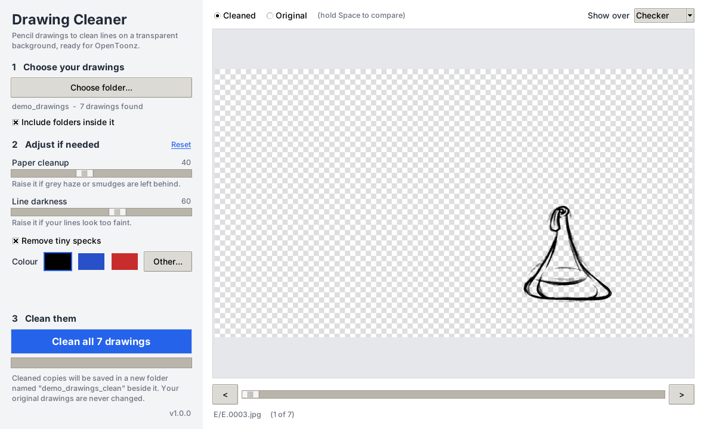

# Drawing Cleaner

Turns photos or scans of pencil drawings into clean lines on a transparent
background, ready to load into OpenToonz (or any animation or compositing
program).



## For students

### Get it

1. Open the [Releases page](../../releases/latest) and download **DrawingCleaner-Windows.zip**.
2. Right-click the zip and choose **Extract All...**
3. Open the extracted folder and double-click **DrawingCleaner.exe**. There is nothing to install.

The first time, Windows may show a blue "Windows protected your PC" box
because the app is new and unsigned. Click **More info**, then **Run anyway**.

### Use it

1. **Choose your drawings.** Click *Choose folder...* and pick the folder that
   holds your drawings (PNG or JPG). Folders inside it are included, so you can
   pick a whole shot at once.
2. **Adjust if needed.** The preview shows the cleaned drawing. Drag the bar
   under it to check other drawings, and hold **Space** to compare with the
   original.
   - *Paper cleanup*: raise it if grey haze or smudges are left behind.
   - *Line darkness*: raise it if your lines look too faint.
3. **Clean them.** Click the blue button. The cleaned drawings are saved in a
   new folder beside yours with `_clean` added to its name.

Your original drawings are never changed. File names and picture sizes stay
the same, so your frame numbers and registration carry over.

### Load the result into OpenToonz

*Level > Load Level...*, go to the `_clean` folder and pick the sequence.

### Tips for better results

- Light the paper evenly and avoid your own shadow falling across it.
- Keep the camera in the same place for every drawing in a shot.
- Fill the picture with the paper. Table edges and pegs in the photo are
  treated as part of the drawing.
- Everything darker than the paper is kept, including timing charts and
  notes in the margins. Erase those in OpenToonz, or crop before cleaning.

### If something looks wrong

| What you see | What to do |
|---|---|
| Grey haze or speckle left on the paper | Raise *Paper cleanup* |
| Faint lines have disappeared | Lower *Paper cleanup*, raise *Line darkness* |
| Lines look too heavy | Lower *Line darkness* |
| "No pictures found there" | Pick the folder that holds the PNG or JPG files |

## For instructors and developers

Run from source (Python 3.10 or newer):

```
pip install -r requirements.txt
python DrawingCleaner.py
```

Without the window, for scripts and batch jobs:

```
python -m drawing_cleaner.cli <folder> [output_folder] --paper-cleanup 40 --line-darkness 60
```

Tests: `pip install pytest` then `python -m pytest tests`.

### Releasing a new version

1. Change `__version__` in `drawing_cleaner/__init__.py`.
2. Tag and push: `git tag v1.0.1 && git push --tags`.

GitHub Actions runs the tests, builds `DrawingCleaner.exe` on Windows, zips it
with a short instruction sheet and attaches `DrawingCleaner-Windows.zip` to a
new release. Students always download from the same
Releases link.

### How it is organised

| File | What it does |
|---|---|
| `drawing_cleaner/engine.py` | The cleaning method. No window code. |
| `drawing_cleaner/app.py` | The window (Tkinter). |
| `drawing_cleaner/cli.py` | Command-line use. |
| `.github/workflows/build.yml` | Tests, builds and zips the Windows app. |
| `packaging/READ ME FIRST.txt` | The instruction sheet that goes in the zip. |
| `docs/PLAN.md` | Design decisions and what could come next. |

## Licence

MIT. See `LICENSE`.
